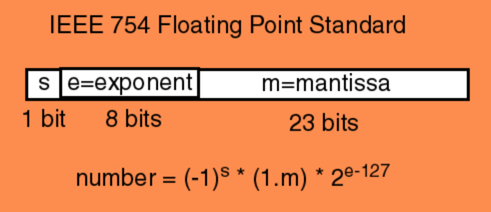
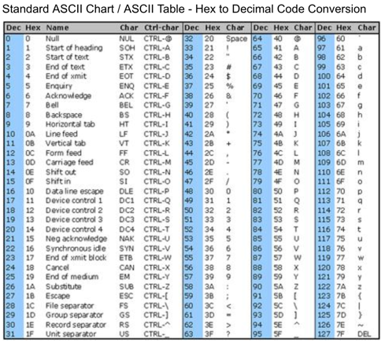

Zeros and Ones
##############

..  include::   /header.inc

Surely, you have heard this:

::

    It is all zeros and ones inside of the machine!

Really?

Let's see!

C++ Integers
************

Here is a some code, not too much past "Hello, World!":

..  literalinclude::    code/ex01/main.cpp
    :linenos:

This simple code creates an array of integers, and displays them. Without
knowing anything else, we know that at runtime, this creates a chunk of space
in the system's memory where this array is stored. Those integer values are
stored in those locations until we fetch them for output.

Let's run this code:

..  command-output:: g++ -o test main.cpp
    :cwd: code/ex01

..  command-output:: ./test
    :cwd: code/ex01

Looks good (if somewhat boring), but we have a start.

Locating Data
=============

What if you really want to know where this data lives in your memory. Can we
figure that out?

Sure, we are programmers, we can figure things out.

C++ provides a neat operator: ``&``, which will tell you the address of something.

Try this:

..  literalinclude::    code/ex02/main.cpp
    :linenos:

..  command-output:: g++ -o test main.cpp
    :cwd: code/ex02

..  command-output:: ./test
    :cwd: code/ex02

..  note::

    You should look up the ``iomanip`` library, it provides a lot of handy
    tools for making you output look nicer.

You see the addresses of each data item here. The notation is called
``hexadecimal``, something we will get soon. That big pile of funny characters
is the actual address in your machine where this data item was stored. (Well,
actually, that is a tiny bit of a lie!, But we will assume is is the real
address for now!) The actual number on your machine might be different.

Addresses in the modern Pentium are actually 64-bit things, and those
hexadecimal strings are not quite right, but they give us an idea where the
data is located. If only we can figure out this hexadecimal stuff!

Show Data in Binary
===================

Let's get rid of weird notation, and see the real zeros and ones! To do this in
C++, we need some help from another tool available in the C++ ``Standard Template
Library``.

..  warning::

    What you will see here involves something called a ``template`` in C++.
    That is an advanced concept, but you do need to see it, and learn to use
    it. For us, just follow the example as best as you can, It is not too hard:

..  literalinclude::    code/ex03/main.cpp
    :linenos:

Phew! That funny line (8) is doing nothing but converting our data item
(``data[i]`` into a 16-bit binary thing that we can send to the ``cout``
method. The conversion creates a new data item named ``bin`` with interesting
properties we will look at later. For now, this lets us see exactly what the
data container is storing, this time looking at all the zeros and ones!

Here is the output:

..  command-output:: g++ -o test main.cpp
    :cwd: code/ex03

..  note::

    I am going to omit the compile step in the future examples, they are all
    exactly the same.

..  command-output:: ./test
    :cwd: code/ex03

Now we see the ``binary`` representation of our ``short`` C++ data values.

Now, I can see all those zeros and ones! Neat!

Once we can see the binary representation of a number, we can learn a bit more
about the this weird binary world:

Counting in Binary
******************

You know how to count, right? All you do is add one to each number. 

..  note:: 

    How do you count in a floating point world? That does not make sense.
    Counting has to do with whole objects, not parts of whole objects.

Integers are about whole things! So add one to count. (Wait, what about
subtracting? We will deal with that in due time!

..  literalinclude::    code/ex04/main.cpp
    :linenos:

..  command-output:: ./test
    :cwd: code/ex04

Patterns
========

Counting in binary is pretty easy. The pattern you see here is worth a closer
look. 

Binary is all about numbers where the only "digits" we have are zero and one. In
our human "decimal" world, you know about the number "columns":

    * The ones column

    * The tens column

    * The hundreds column

When we write a number like ``123`` down, what we really mean is this:

    * 3 ones

    * 2 tens

    * 1 hundred

All of those numbers are powers of 10. 

..  math::

    10^{0} = 1

    10^{1} = 10

    10^{2} = 100

Base of a Number System
-----------------------

We have ten symbols, which we call ``digits``, available in our `decimal`
system.

The number of symbols available in that system is called the ``base`` of that
system

In `binary` we restrict the number of symbols to two, and we choose to use zero
and one, not for any special reason, other than we are most comfortable with
those.

In fact, the symbols themselves are not important. It is how we use them that
is important. 

If I give you a symbol, and ask what comes before that one, or after that one,
you know the answer. Well, maybe you need to know a bit more, but you get the
idea.

Running Out of Bits
===================

What happens when we run out of bits to store something in? Well, we are stuck.
A fixed size container can only hold a fixed number of bits. Keep counting in a
16-bit container, and you run out at 65535. Why?

Every column represents a power of two, Sixteen bits means that the last column
is the :math:`2^{15}` column. (Why not 16? (We started at zero!)

Add up all those powers of two and you get 65535. We can represent a total of
:math:`2^{16}` distinct whole numbers in 16 bits! (0-65535).

If you need a bigger number, you need more bits!

Binary Counting Pattern
=======================

Look at the series of binary numbers above. The "ones column", which in binary
is two raised to the zero power, alternates every count. We run out of symbols
quickly in binary, and "carry" a one into the next column.

The "twos column" (two raised to the first power) alternates every two counts.

The "fours column" (two raised to the second power) alternates every four
counts.

And so on. Each "column" is another power of our base, two in this case.

Once you have that pattern down, counting in binary is easy!

Hexadecimal
===========

Now, writing down a 64-bit number is going to take a lot of zeros and ones
(duh!). Being lazy, programmers came up with a shorter way to represent them.

Suppose we can come up with a symbol system that has 16 symbols (yikes!) We
could use one symbol for every four bits, and shorten this up a bunch. Here is
the coding scheme:

..  csv-table::
    :header: decimal,  Binary,  HEX

    0      ,  0000  , 0
    1      ,  0001  , 1
    2      ,  0010  , 2
    3      ,  0011  , 3
    4      ,  0100  , 4
    5      ,  0101  , 5
    6      ,  0110  , 6
    7      ,  0111  , 7
    8      ,  1000  , 8
    9      ,  1001  , 9
    10     ,  1010  , A
    11     ,  1011  , B
    12     ,  1100  , C
    13     ,  1101  , D
    14     ,  1110  , E
    15     ,  1111  , F

Now, that 64 bit number is down to 16 characters.

Negativity!
***********

What happens if we count backward, subtracting one each time?

That is not so bad, except for one thing. How do we "borrow" from the next column?

As long as there is a one there, we can do that. Actually, you borrow the same
way you did when you learned subtraction in your early days!

But, go back and look at the binary representation of minus five! That one
looked very strange!

Twos Complement
===============

We humans are kind of picky. If we add minus five to positive five, we want the
result to be zero! No exceptions!

How are we going to represent a negative number, using only bits?

One idea is to steal one of the bits and make it represent the sign of the number.

    * if 0000000000000101 is five
    
    * then  1000000000000101 is minus five

There is a problem with this! Try adding them together. 

..  warning::

    Remember, this is binary, so when you get a two. you write down a zero, and
    "carry" a one into the next column. If you get a three, write down a one,
    and carry a one into the next colun. You know how this works!

..  code-block:: text

    0000000000000101
    1000000000000101
    ================
    1000000000000110

Boy, that does not look anything like zero.

Math folks pondered this a while, and came up with this idea:

To convert any positive number into the negative of that number, do this:

    * Complement the number

    * Add one

No complement does not mean to say "you are a fine number". Instead is says
flip every zero into a one, and every one into a zero. Weird, but watch what
happens:

    * +5         = 0000000000000101

    * Complement = 1111111111111010

    * Add one    = 1111111111111011

This looks a bit odd. But lets try adding them together:

..  code-block:: text

    0000000000000101
    1111111111111011
    ================
   10000000000000000

Look closely, there is a 17th bit showing there. It is a one! But, since the
result must be squashed into a 16-bit container, we just put the lower 16 bit
in, and toss that extra bit. 

Hey, we end up with zero!

As odd as this seems, this is exactly how we store negative whole numbers in
the computer. In ``Twos Complement`` form!

Obviously, with more bits, the machine can store bigger numbers!

Floating-Point Numbers
**********************

Now that we have a handle on integer numbers, let's look at how we store a
number with a decimal point.

The idea starts off with a simple thought.

What happens when we use that decimal point thingy?

Each digit we place to the right of the decimal point represents the *base*
raised to a negative power:

    * 1.25 

    * one times :math:`10^{0}`
    
    * plus two times :math:`10^{-1}`

    * plus five times :math:`10^{-2}`

If we switch to binary, we get this:

    * 1.01

    * one times :math:`2^{0}`
    * zero times :math:`2^{-1}`
    * one times :math:`2^{-2}`

Hey, those numbers are the same!

    * (1 * 1) + (0 * 0.5) + (1 * 0.25) = 1.25!

We could stay with this idea and do fairly well with simple floating-point numbers,
but we run into problems quickly.  Some folks, like engineers and physicists
want to use numbers with an insane number of digits before or after that
decimal point. Like 0.00000000000123!

Real, human, floating point numbers are struggling to represent something that
has an infinity of values. Unlike our simple integers, there are an infinite
number of values between any two other values. That gets messy very fast. 

If we cannot write a number down, how can we possibly store it in our computer
exactly? The answer is we can't, but we can get close1

We need a way to represent these numbers well enough to be able to use them.
Those pure math types will just have to learn to deal with that if they want to
use our computers!

Folks came up with a different way to express a floating point number to deal
with this:

    * 123450000000000.0 = 1.2345 * :math:`10^{14}`

Let's write this this way:

    ( 1.2345E14

The ``E`` means "exponent". The number after the ``E`` is a number, which can
be negative). That number tells you how to slide the decimal point into the
right position. ``E14`` says slide it 14 columns to the right , ``E-14)`` would
say slide it 14 columns to the left!

    * 1.2345E-14 = 0.000000000000012345

This is called "Scientific Notation".

Truncating Numbers
==================

When we deal with floating-point, we accept the fact that the right-most digits
are not so important, compared to the left-most digits. If we have a big
number, and we lost that right-most digit, we still have a pretty big number,
close to the original number, but off by some tiny amount.

In engineering and science, we accept the fact that some calculations are not
going to be exact.  Still, we want them to be as close to exact as we can make
them.

A team of folks, all of whom belong to the IEEE, got together, and came up with
this idea for representing floating-point numbers in computers. Their work is
now known as `IEEE Standard 754
<https://en.wikipedia.org/wiki/IEEE_754#Representation_and_encoding_in_memory>`_

Basic Representation
====================

Take a fixed size container, say 32-bits big. Cut it into two basic parts, one
24-bits big, and the other 8-bits big.

We will encode the "significant digits", the ones we are keeping in our
"Scientific Notation" - after truncating, in the 24-bit part. Since that
leftmost bit should always be a one (to be considered significant), we will not
store that bit. Instead, we will assume there is another bit in the number, and
it is a one. Hey, every little bit helps!

The entire number is either positive or negative. Because of this, they stole
one bit from the big part and called that one the "sign bit". The rest of the
big chunk is called the "mantissa", and the small part is called the "exponent"

Naming the parts
----------------

The "exponent" is a whole number, so they simply took those eight bits and
encoded it as an 8-but twos complement number. That give us the ability to move
the decimal about 128 columns left or right. Should be fine for calculating the
interest on your bank balance.

We Need More Bits!
------------------

But what if 32-bits is not be enough. The answer is simple, use more bits! We
will not go there, this is enough for an introduction.

Here is a diagram showing the IEEE layout for a 32-bit "single precision"
floating point number:

Encoding Characters
*******************

We only have a finite number of "symbols" in our English character set. It
should be pretty easy to come up with a way to assign a code for each
character. That was exactly the mission of another group. They came up with the
"American Standard Code for Information Interchange", ``ASCII`` for short. Here
is their encoding:

Look at this encoding, it has nice properties. 

All of the digits are in order. Whatever the code is for a five, add one to
that code and you have the code for a six.

The code for a "B" is one more than the code for a "A". Add 32 to the code for
"A", and you get the code for "a". We can use that to capitalize something,
or sort things according to the order of characters in our alphabet.

Actually, the codes below the code for a space character, are called "control
codes". They are not "printable". They were used to control printing devices
in the "old days". Today, the only ones we tend to deal with are "CR" (carriage
return) and "LF" (line feed). Most of you do not even know where those terms
came from!

How Big are ACSII Codes?
========================

ASCII is a set of 128 symbols. That takes seven bits to store. Since seven is
an UGLY number, we use 8! That means each character takes one byte. 

We could do something with that extra bit. In fact, IBM did just that, creating
a bunch of symbols we could use to build forms on the screen. Remember, they
wanted to sell machines to accountants!

They managed to fill up all 256 slots available in a chunk of memory,
each chunk addressed using an 8-bit binary number.

Unicode
=======

We will not explore this here, but you should be aware that there is a push to
stop using ASCII in our programs, and switch to Unicode.

Why!

How many characters are there in the Chinese "alphabet"? I put that word in
quotes, because in Chinese, the symbols may represent an entire sentence in
English. A book I bought in Shanghai told me I had to learn 4000 symbols to
read a Chinese newspaper. (I never finished that book).  4000 is too big to fit
in 8-bits. But it will fit in 16-bits.

Unicode was invented to deal with all human languages, even Chinese! There are
codes (and graphical symbols) available for most of the languages we are aware
of, even Klingon!

I will let you explore that on your own.

Encoding other Things
*********************

We humans are good at encoding things. We have come up with ways to encode
sounds, colors, phases of the moon. Just abut anything you might need to
process in a computer can be encoded somehow, then stored as zeros and ones
inside of the machine

Your real challenge is to come up with code that makes those encoded gadgets
work the way you want!

..  vim:ft=rst spell:
