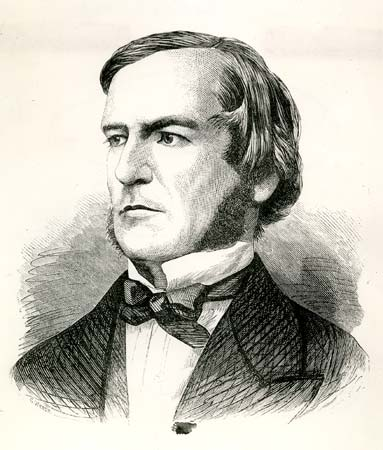

..  _boolean-algebra:

Boolean Algebra
###############

..  include::   /header.inc

Math can be a lot of fun. (OK, many folks cannot believe math can ever be called
fun, but over the course of history, it sure has gotten a lot of attention.)

Here is `George Boole`_:

Way back in 1854 George Boole published a book :cite:`Boole:1854` where he
studied the mathematics of a number system with only two symbols: "0" and "1".
We can also call those two values *true* or *false* if we wish, but let's stick
with our familiar numbers.

..  note::

    By the way, one of George's famous papers is part of "God Invented the
    Integers", a collection of famous math works edited by Stephen Hawking.
    :cite:`Hawking:2007`. This book is tough to read, but worth the effort!
    
George wanted to understand how a system of mathemetics would work if
restricted to just those two values. His theories have became known as *Boolean
algebra* and are important to us computer folks. His work was recognized as a
foundation for computer systems that also work with just two states: *on* and
*off*. (For some reason, computer folks still insist on saying machines work with
"ones" and "zeros", but it really is not so.)

Arithmetic
**********

The basic arithmetic operations we are all familiar with are the first place we
run into something interesting. A few results work just fine. Let's start off
by considering *addition*:

..  math::

    0 + 0 = 0

    1 + 0 = 1
    
    0 + 1 = 1

But what about this next one?

..  math::

    1 + 1 = ?

Instinctively, you want to write down "2", but there is no such number in this
system. In binary the result should be "10", which is also
illegal in this system. The only result that makes sense (at least to George)
is "1", since it surely cannot be "0" (the only other possibility)!

So:

..  math::

    1 + 1 = 1

In fact, using this philosophy, the following is also true:

..  math::

    1 + 1 + 1 + 1 = 1

Now that seems just plain silly, and hardly useful. But it really leads to
something very useful!

Subtraction
===========

Subtraction does not really make much sense, since, by definition, subtraction
is identical to addition of negative numbers, which do not exist in George's
boolean world. So we will ignore that operation.

Multiplication
==============

Multiplication still seems reasonable:

..  math::

    0 * 0 = 0

    0 * 1 = 0

    1 * 0 = 0

    1 * 1 = 1

No problems there!

Division
========

Once again, we run into another problem, just as with subtraction. Division is
repeated subtraction, and we eliminated that operation. So, division goes out
as well!

That is all we need for now. But exactly why this form of math is useful needs
to be explored.

Truth Tables
************

Remember back when you were learning about "logical expressions"? You should
have been introduced to *truth tables*, which showed exactly how the logical
operators worked. Here is a refresher:

..  csv-table::
    :widths: 10,10,10,10
    :header:  Op, in1, in2, out

    **AND**, 0, 0, 0
    , 0, 1, 0
    , 1, 0, 0
    , 1, 1, 1

    **OR**, 0, 0, 0
    , 0, 1, 1
    , 1, 0, 1
    , 1, 1, 1

Do you see a pattern here? The truth table for the *AND* operator follows George's
math rules for multiplication, and the table for the *OR* operator follows George's
math rules for the addition opeator! Interesting!

Boolean Variables
*****************

Let's add variable names to our system. Convention says these are single
capital letter names. (I capitalize things to yell at myself. This is to remind
me that the variables only have two possible values!)

Assume a variable ``A`` has some boolean value. The *compliment* (opposite) of
that value is denoted using a bar over the variable name. Like this:

..  math::

    \overline{A} 

The rules for this notation look like this:

..  math::

    if\ A == 1\ then\ \overline{A} == 0

    if\ A == 0\ then\ \overline{A} == 1

Boolean Algebra
***************

With these definitions in place, we can define a few rules for *boolean
algebra*. Most of these should be obviously true.

..  note::

    In the formulas presented below, we will follow standard conventions and
    use the standard math operator "+" to denote **OR** and the standard
    math operator "*" to denote **AND**. (Personally, I really wanted addition
    to use that **AND** operator, because it seemd to make sense. But not to
    George. I finally got over that urge!)

    
..  math::

    A + 0 \equiv A

    A + 1 \equiv 1

    A + A \equiv A

(Boy, that last one probably makes your head hurt! Remember, this is *Boolean*
Math)

..  math::

    A + \overline{A} \equiv 1

    0 * A \equiv 0

    1 * A \equiv A

    A * A \equiv A

    A * \overline{A} \equiv 0

    \overline{\overline{A}} \equiv A

That last one works for any even number of compliments!

There are a few other rules that are useful. 

..  math::

    A + B \equiv B + A 

    A * B \equiv B * A

    A + (B + C) \equiv (A + B) + C

    A * (B * C) \equiv (A * B) * C

    A * (B + C) \equiv A * B + A * C

These formulas are useful because there is an equivalence between boolean
algebraic formulas and digital circuits involving the fundamental components
(aka gates) we use to build them.  We can actually set up digital circuits as
boolean expressions, then simplify those expressions and produce a simpler
circuit that operates the same way. This is a key concept in designing digital
systems.

As an example of simplifying a *boolean expression*, let's prove the following:

..  math::

    A + A * B \equiv A

See if you can follow this sequence of operations:

..  math::

    A * (1 + B) \equiv A

    A * 1 \equiv A

    A \equiv A

This sequence can be produced by applying the rules shown above using familiar
algebraic operations. 
*
De Morgan's Theorems
*******************

There are a few more rules that are very useful in simplifying *boolean
expressions* (circuits) They were developed by Augustus De Morgan, and named
after him.

..  math::

    \overline{A * B}  \equiv \overline{A} + \overline{B}

    \overline{A + B} \equiv \overline{A} * \overline{B}

Again, these are very handy when we need to simplify an expression. Simpler
expressions lead to fewer components and lower cost. They might also lead to
more speed, and we like that!

Exclusive OR
************

There is one more logical operator that is very useful in digital design: The
**XOR** operator. This operator has the following truth table:

..  csv-table::
    :widths: 10,10,10,10
    :header:  Op, in1, in2, out

    **XOR**, 0, 0, 0
    , 0, 1, 1
    , 1, 0, 1
    , 1, 1, 0

The operator produce a "1" if and only if one of the two inputs is a "1". It
produces a zero otherwise.

This operator often appears in *Boolean Algebra* as a funny symbol in some
texts, but we can do better. Since we have eliminated subtraction from our
system, let's use the minus sign as the operator. This has unexpected
consequences, but *Boolean Algebra* seems to have lots of those:

..  math::

    X - 0 \equiv X

    X - 1 \equiv \overline{X}
     
    X - X \equiv 0

    X - \overline{X} \equiv 1

We will develop a couple of additional rules involving this operator later.

