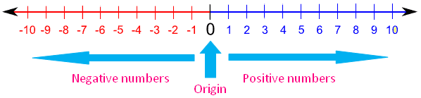

Human Numbers vs Digital Numbers
################################

..  include::   /header.inc
..  vim:filetype=rst spell:

Now that you know how we store digital numbers in memory, what does this mean
when we compare "normal" math to the math computers do?

The answer is subtle, but very important.

In one of your math courses, surely you were introduced to the concept of a
``number line``. That is a line stretching out to infinity in the positive
direction, and to negative infinity in the negative direction. "Numbers", as we
were trained to think of them back then, are just points along that line
somewhere.

Simple.

Mathematicians love this picture. They can talk for hours about how operations
like addition, subtraction, and  multiplication work. When they get to
division, things get messy!

Human Kinds of Numbers
**********************

In your math class you may have been introduced to several different kinds of
"Human" numbers.

Natural Numbers
===============

    * Symbol: :math:`\mathbb{N}`

``Natural numbers`` are whole numbers, we use for "counting". We may include
zero in this set of numbers. Another term for these numbers is ``unsigned``.
There are no "fractional" numbers in this set. These numbers fall at specific,
evenly spaced points on that "number line", headed off toward ``infinity``

Integers
========

 * Symbol: :math:`\mathbb{Z}`

``Integer numbers`` are also a form of counting, but what does it mean to have
-5 sheep? I guess you rented some, and have to subtract that number from the
number you own!  Again, these have no fractional part. 

   
Rational Numbers
================

    * Symbol: :math:`\mathbb{Q}`

``Rational numbers`` represent numbers that can be expressed as the ratio of
two integers. That means a whole number divided by a whole number. A number
like 1/3 is ``rational``, even if we cannot write it down as a number with a
decimal point.  (You need too many digits needed to express it exactly!)

Real Numbers
============

    * Symbol: :math:`\mathbb{R}`

``Real numbers`` are expressed using a decimal point. These numbers can have an
infinite number of digits on either side of the decimal point, and can be
either positive or negative. Potentially, every point on that number line can
be expressed as a ``Real Number``. 

Every ``rational number`` is also a ``real number``.

Irrational Numbers
==================
    
* Symbol: :math:`\mathbb{I}`

``Irrational numbers`` are numbers that are not ``Rational``. Simple enough!
That means every other number *except* for those that are ``rational`` on that
number line . 

Every ``irrational number`` is also a ``real number``.

Imaginary Numbers
=================

    * Symbol: :math:`i`

Boy, if ever a number ought to be called ``irrational``, it is the number
representing the square root of -1! We all know that no such number exists.
However, in the world of mathematics,  it turns out very handy to pretend that
such a number exists, and we call it an ``imaginary`` number.

Complex Numbers
===============

    * :math:`\mathbb{C}`

If we combine two numbers, one ``real``, and one ``imaginary``, and plot them
on a graph, with the real numbers representing points along one axis, and
``imaginary`` numbers representing points along the other axis, we map out
something called the ``complex plain``. We write a ``complex number`` as the sum
of a ``real`` part, and an ``imaginary`` part. 

    * :math:`5-4i`
      
By the way, the number zero is both ``real`` and ``imaginary``.

Euler's Formulas
----------------

Using ``complex numbers`` we are able to understand a lot about how electricity
works. This kind of math is a big part of the study of electronic devices that
make up our digital world.

I am reading a book on Euler's Formula :cite:`Stipp:2017`:

    * :math:`e^{i\theta } = \cos{\theta} + i\sin{\theta}`

When :math:`\theta = \pi` this becomes this amazing formula:

    * :math:`e^{i\pi} = -1`

How on Earth did he come up with that? The book lays it out.

::

    Euler's formula is "the most remarkable formula in mathematics"

    Richard Feynman

Computer Numbers
****************

Computer numbers are very different. For one thing, there is no way we can
have an infinite number of them! We only have so many bits to encode them and
land them in our memory. Infinity? That is not going to happen in a computer!

The easiest way to visualize digital numbers is simple to place specific marks
on the number line. This works for both Integer numbers and Floating point
numbers. Those spots mark places where our digital numbers coincide with human
numbers. Any other human number simply cannot be represented in a machine,
unless we come up with a different encoding scheme.

Furthermore there are boundary points beyond which any given number container
(with some fixed number of bits) can't handle bigger values. Beyond those
barriers, we cannot store the values. If we need to process bigger numbers, we
need to increase the size of our containers!

Computer Math
*************

Think about arithmetic operations using ``integers``. All operations except
division are well behaved.  They always create integer results, and we can
represent those answers exactly with our machines, as long as we have enough
bits available. 

When we deal with division, things get messy. If we want
to express the result of the division as an ``integer`` number, we basically
take the nearest whole number ``smaller`` (back toward zero) than the "correct"
human result. (One divided by two is one half, we just "know" that is right.
But in the computer world, there is no ``integer`` number with that value. We
drop the fractional part leaving the ``integer`` result: zero!

..  warning::

    You might not believe how hard it is to get humans to understand that
    simple concept!

Errors Accumulate
=================

Humans write programs. They really want the results of their math operations to
generate the "correct" answers. But machines can never be expected to be able to
express every "correct result. They may easily be off.

If the machine was off on one calculation, then uses that number in further
calculations, the errors can increase. (In some rare cases, the may actually
improve, but we will ignore that). 

The best we can do is find the best "digital number" closest to that human
"correct" number and accept that result. We may be "off" by some hopefully
small amount, but we *are* off in many cases! Furthermore, we can study how we
do our math and learn how to minimize these errors. That is precisely what I
did as a "Computational Fluid Dynamicist" years ago!

..  note::

    There are classic examples of this kind of cumulative math errors resulting
    in totally wrong answers. If done wrong, your math can be very bad, done
    right, and things work as expected. I saw an example of this in college
    where we were "inverting" a matrix of whole numbers, and the "correct answer
    also was another matrix with whole numbers. However, our simple computer
    programs trying to get that "correct" answer produced gibberish. Scary, but
    we got the point.

There is an entire branch of mathematics that explores these issues. You will run
into it at some point in your career: Discrete Math! 

