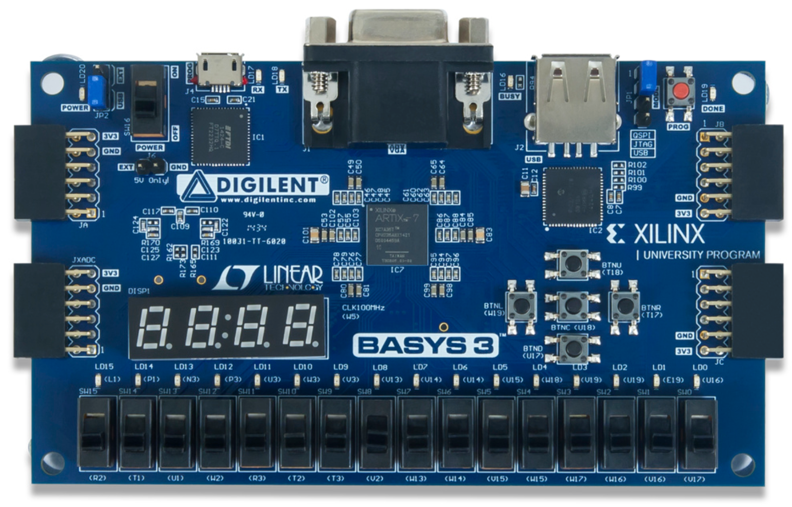

Boolean Functions
#################

..  include::   /references.inc
..  wordcount
..  vim:ft=rst spell:

Mathematicians could not stop pondering George's new Boolean world! They kept
coming up with interesting puzzles.

Suppose you have two ``Boolean variables``: ``A``, and ``B``. Since each one
can take on two possible valus, there are four combinations of those variables:

..  csv-table::
    :header: A, B

    0,0
    0,1
    1,0
    1,1

We used this arrangement to show how to build ``truth tables`` from George's
Algebra. The **AND**, **OR**, and **XOR** tables wre shown earlier. These
mathematician folks wondered if there were any other interesting tables they
could form. To find out they noted that the truth tables produced four output
values. That make sense if we define a ``function`` as an operation that maps
two ``input variables`` into one ``output value``. Each row in the ``truth
table`` tells us how this particular function works. 

These functions are not like others you are used to, like ``sqrt``. These
functions are ``digital`` in nature, they take in discrete digital values (0 or
1) as a value for each input, and return a single digital value (again 0 or
1).

If there are four possible outputs for the two variables, there must be a total
of 16 different functions we could define using this ``truth table`` scheme,
let's see what they are:

..  csv-table::
    :header: A, B, f0,f1,f2,f3,f4,f5,f6,f7,f8,f9,f10,f11,f12,f13,f14,f15

    0,0,0,0,0,0,0,0,0,0,1,1,1,1,1,1,1,1
    0,1,0,0,0,0,1,1,1,1,0,0,0,0,1,1,1,1
    1,0,0,0,1,1,0,0,1,1,0,0,1,1,0,0,1,1
    1,1,0,1,0,1,0,1,0,1,0,1,0,1,0,1,0,1

..  warning::

    Each column in this table is a unique ``truth table`` for one function.

What Are These Functions
************************

Here they are:

    * f0 = **ZERO**
    * f1 = **AND**
    * f2 =
    * f3 = **A**
    * f4 = **NOT A**
    * f5 = **B**
    * f6 = **XOR**
    * f7 = **OR**
    * f8 =
    * f9 =
    * f10 =
    * f11 =
    * f12 =
    * f13 = **NOT X**
    * f14 =
    * f15 = **ONE**

You should to fill in the missing entries as an exercise.

Why is This Interesting?
************************

We are going to model a real computer. We will build this machine out of simple
``components``. Those ``components`` take in a certain number of ``input
signals``, each a ``Boolean variable``. They will output one or more ``output
values``, with values of 0 or 1! We can model what they do inside using a
simple table that lists all possible output values. We look at the inputs, then
simply ``look up`` the desired output values and return them. The table is just a
tiny array of numbers indexed by those input variables! Cool!

This is exactly how new gadgets called ``Field Programmable Gate Arrays`` are
programmed. Basically, these little machines have a slew of ``Look Up Tables``
that you can "program" to create some digital thing. You can then stitch
together all of your small widgets to form a bigger one. Some of these FPGA
have millions of these basic building blocks, and you can program then to become a
real computer we can fire up and run. Chip designers use these things to test
out a design. When it is working properly, they send the code they wrote to
program the FPGA to a simple conversion program called a "synthesizer" that
churns out a real computer chip that they can fabricate. Hardware design has
morphed into a software design problem! Wow!

Here is one of my FPGA boards:

